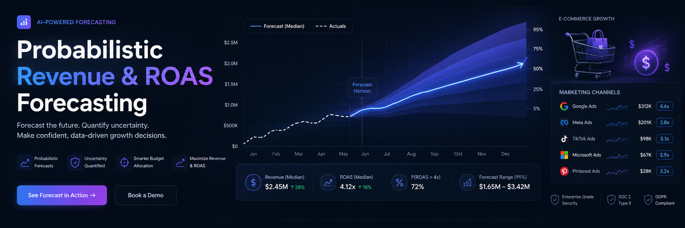
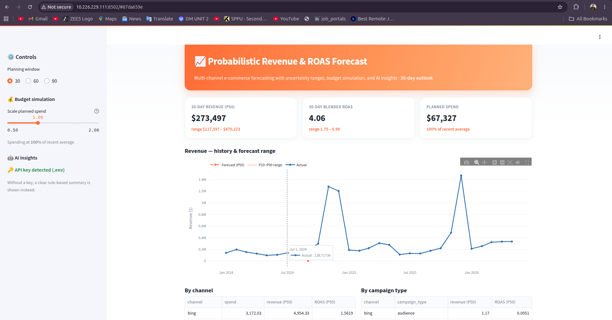
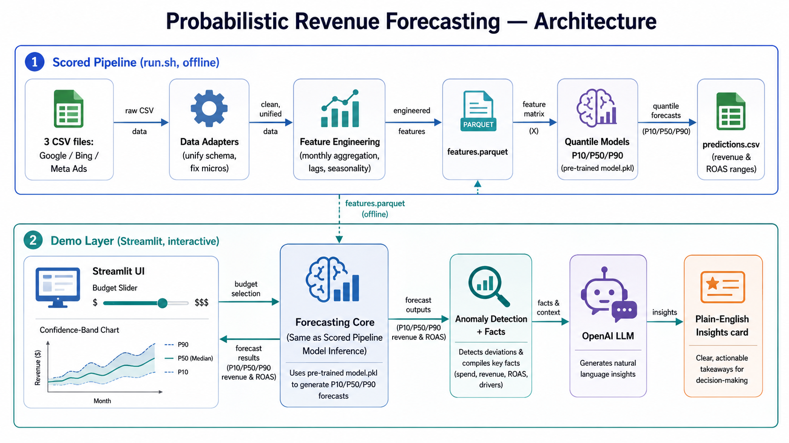
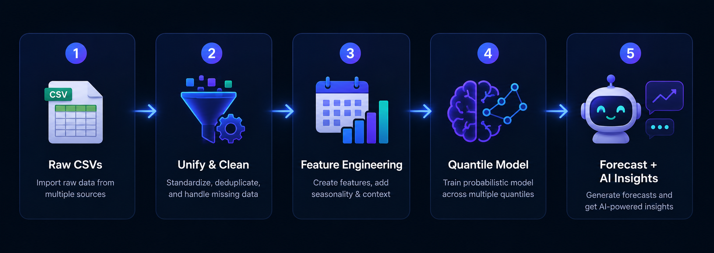
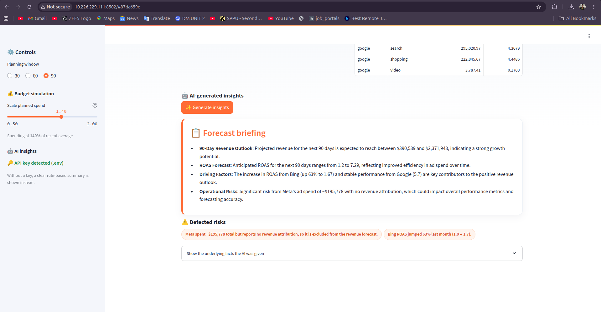
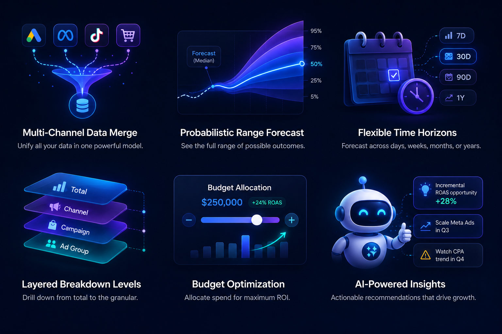

<div align="center">



# 📈 Probabilistic Revenue & ROAS Forecasting

### An AI-assisted forecasting utility for e-commerce marketing

Predict **revenue** and **ROAS** as probabilistic ranges (P10 / P50 / P90) across
30 / 60 / 90-day windows — with budget simulation and LLM-generated insights.


**🔗 [Live Demo](https://your-app.streamlit.app)** · **👥 Team BrainBytes**

</div>

---

## ✨ Overview

Digital marketing agencies must estimate future business outcomes *before* budgets
are deployed — a hard, fragmented, spreadsheet-driven problem. This utility unifies
multi-channel ad data (Google, Bing, Meta), produces **probabilistic** revenue and
ROAS forecasts, supports **budget simulation**, and generates **AI causal
summaries** — turning retrospective reporting into forward-looking decision support.

<!-- dashboard screenshot -->
<div align="center">

</div>

---

## 🚀 Key Features

| | Feature | What it does |
|---|---------|--------------|
| 🔀 | **Multi-channel unification** | Normalizes Google / Bing / Meta schemas into one clean dataset |
| 🎯 | **Probabilistic forecasts** | Revenue & ROAS as P10 / P50 / P90 ranges, not single guesses |
| 📅 | **Flexible horizons** | 30 / 60 / 90-day aggregate planning windows |
| 🧱 | **Multi-level breakdowns** | Total, per-channel, and per-campaign-type forecasts |
| 💰 | **Budget simulation** | "What if I spend X?" — live response with diminishing returns |
| 🤖 | **AI insights** | Grounded LLM summaries of drivers, anomalies, and risks |

---

## 🏗️ Architecture

<div align="center">

</div>

The **scored pipeline** (`run.sh`) is fully offline and deterministic. The **demo
layer** reuses the same forecasting core and adds interactivity + the LLM insights.

---

## 🔬 How It Works

<!-- pipeline flow illustration -->
<div align="center">

</div>

1. **Ingest & unify** — per-platform adapters normalize columns, fix Google "micros", and align campaign-type spellings.
2. **Feature engineering** — daily data aggregated to monthly buckets; lag, rolling-mean, and seasonality (holiday) clues; no data leakage.
3. **Probabilistic model** — three gradient-boosted quantile regressors (P10/P50/P90) on `log1p(revenue)`, pooled across channels.
4. **Forecast & roll-up** — recursive monthly roll-forward to 30/60/90 days; ROAS derived as revenue / spend; aggregated to channel and total.
5. **Explain** (demo only) — grounded facts + anomaly detection → LLM briefing.

---

## ⚡ Quick Start

### Run the forecasting pipeline

```bash
# 1. create the environment (Python 3.11)
pip install -r requirements.txt

# 2. run the full pipeline (feature generation + prediction)
./run.sh ./data ./pickle/model.pkl ./output/predictions.csv
```

Output is written to `output/predictions.csv`. `run.sh` accepts three optional
positional arguments with sensible defaults:

```
./run.sh <DATA_DIR> <MODEL_PATH> <OUTPUT_PATH>
```

### Run the interactive demo

```bash
# add your OpenAI key (optional — without it, a rule-based summary is shown)
cp .env.example .env        # then edit .env and paste your key

streamlit run app.py
```

---

## 🤖 AI Insights

The LLM is **grounded** in computed facts (recent revenue/ROAS, per-channel trends,
the forecast) and explainable anomaly flags — so summaries are specific and
trustworthy, never hallucinated. Works with or without an API key (graceful
rule-based fallback).

<!-- AI insights screenshot -->
<div align="center">

</div>

---

## 📄 Output Format (`predictions.csv`)

One row per (level, channel, campaign_type, horizon):

| column | meaning |
|--------|---------|
| `level` | `total`, `channel`, or `channel_type` |
| `channel` | `google` / `bing` / `ALL` |
| `campaign_type` | e.g. `search`, `performance_max`, `ALL` |
| `horizon_days` | 30 / 60 / 90 |
| `planned_spend` | assumed spend over the horizon |
| `revenue_p10/p50/p90` | revenue forecast range |
| `roas_p10/p50/p90` | ROAS forecast range |

---

## 📊 Validation

Time-based backtest. At the **total** (scored) level: **~13% MAPE** with
well-calibrated P10–P90 coverage. Finer grains are noisier and are communicated
honestly as wider ranges rather than overstated precision.

<div align="center">

</div>

---

## 📁 Repository Structure

```
.
├── run.sh                    # single entry point (features -> predictions)
├── requirements.txt          # pinned dependencies
├── app.py                    # Streamlit demo UI
├── .env.example              # template for the OpenAI key
├── data/                     # input CSVs (overwritten with test data at scoring)
├── pickle/
│   └── model.pkl             # pre-trained, committed model artifact
├── src/
│   ├── config.py             # canonical schema + shared mappings
│   ├── data_loader.py        # per-platform adapters -> one unified table
│   ├── features.py           # monthly aggregation + lag/seasonality features
│   ├── generate_features.py  # entry: data/ -> features.parquet
│   ├── model.py              # quantile (P10/P50/P90) model definition
│   ├── train.py              # OFFLINE training + backtest -> model.pkl
│   ├── forecast.py           # recursive roll-forward + budget simulation
│   ├── predict.py            # entry: features + model -> predictions.csv
│   └── insights.py           # anomaly detection + LLM explanation (demo)
├── docs/                     # technical + architecture documentation
└── README.md
```

---

## 📚 Documentation

- [`docs/TECHNICAL.md`](docs/TECHNICAL.md) — methodology, model selection, validation.
- [`docs/ARCHITECTURE.md`](docs/ARCHITECTURE.md) — stack, modules, pipeline, LLM workflow.

---

## ⚠️ Assumptions & Limitations

- **Meta has no revenue or campaign-type data**, so revenue forecasts cover the
  channels that report revenue (Google, Bing); Meta is treated as spend-only.
- Forecasts are **aggregate-period** (not daily) and **probabilistic ranges**.
- Existing channel attribution is treated as the source of truth.
- Reproducible: seeds fixed (`random_state=42`), no absolute paths, no network
  calls during the scored run.

---

## 👥 Team BrainBytes

- **Shivani Kapase** — Team Leader
- **Yashvant Mane**

*Modern Education Society's Wadia College of Engineering, Pune*

<div align="center">
<sub>Built for AIgnition 3.0 · NetElixir</sub>
</div>
